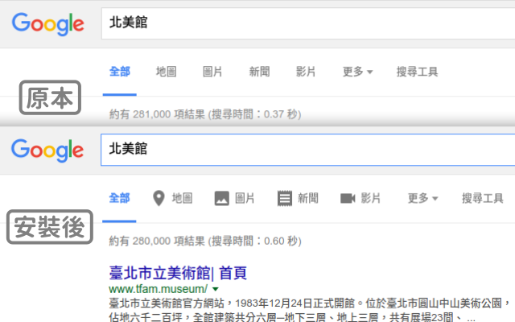

# Chrome/Safari 擴充套件：不要再按錯搜尋圖片！

Google 搜尋選項中的「圖片」、「影片」、「地圖」實在長得太像了，很容易按錯，為什麼不加個圖示更清楚呢？

僅支援台灣 Google 搜尋（只會在 www.google.com.tw 網域新增圖示）。

## Chrome 安裝

至 [Chrome 線上應用程式中心](https://chrome.google.com/webstore/detail/%E4%B8%8D%E8%A6%81%E5%86%8D%E6%8C%89%E9%8C%AF%E6%90%9C%E5%B0%8B%E5%9C%96%E7%89%87%EF%BC%81/ookjbnaeaelckplpaileancnodhjljej?hl=zh-TW&gl=TW) 下載安裝。

### 開發者手動安裝

1. 下載本套件原始碼。
2. 打開 **Chrome 擴充功能** 設定頁 (或輸入網址 `chrome://extensions`)。
3. 勾選 **開發人員模式 (Developer mode)** 。
4. 點選 **載入未封裝擴充功能... (Load unpacked extension...)** 。
5. 選取本套件目錄 `Chrome/iconify-gsearch/`，即可安裝！

## Safari 安裝

本套件並未上架 Safari Extensions Gallery ，但仍可手動安裝如下。

### 開發者手動安裝

1. 下載本套件原始碼。
2. 開啟「開發人員選單」：**偏好設定** 中 **進階** 頁籤，勾選 **在選單列中顯示「開發人員」選單**。
3. **開發** 選單中，選擇 **顯示延伸功能建構器**。
4. 按左下角 **+** 新增延伸功能，選取本套件目錄 `Safari/iconify-gsearch.safariextension` 。
5. 按 **安裝** 即生效！

## 圖示來源

[Google Material Icons](https://design.google.com/icons/)

## 隱私權

本套件不會連網，亦不會蒐集任何資料。

## 授權

[GNU GPLv3](LICENSE)

你可以自由使用本軟體、了解本軟體是如何運作的、自由複製分享本軟體、自由修改以及散布修改後的版本。
